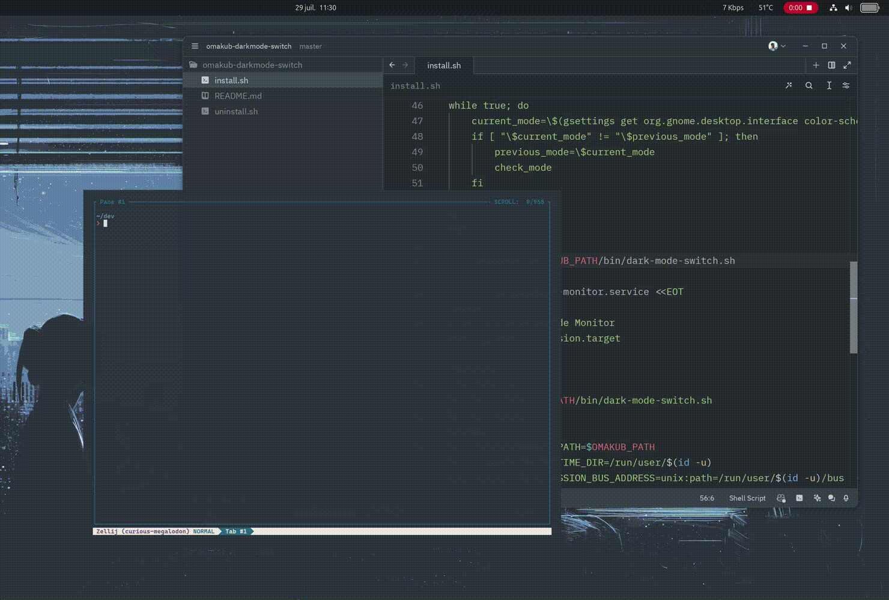

# Omakub light/dark mode switch

A simple [Omakub](https://omakub.org/) extension to add a listener on light and dark mode so that it can switch from a light theme to a dark theme.



# Install

```
git clone git@github.com:florentdestremau/omakub-darkmode-switch.git
cd omakub-darkmode-switch
source install.sh
```

# Uninstall
If you don't want this extension anymore, you can uninstall it very simply this way. 
```
source uninstall.sh
```

# How it works

Following a [pull request](https://github.com/basecamp/omakub/pull/206) I made on the main omakub repo, I created a script that watches the `gsettings` and detects the ligth/dark mode switch.

# Why only "Rose Pine" as a light theme ?

In the current themes available on Omakub, only Rose pine is considered a light theme and sets `gsettings set org.gnome.desktop.interface color-scheme 'prefer-light'`.
If needed open an issue and I will be happy to help you set it up anyways.
